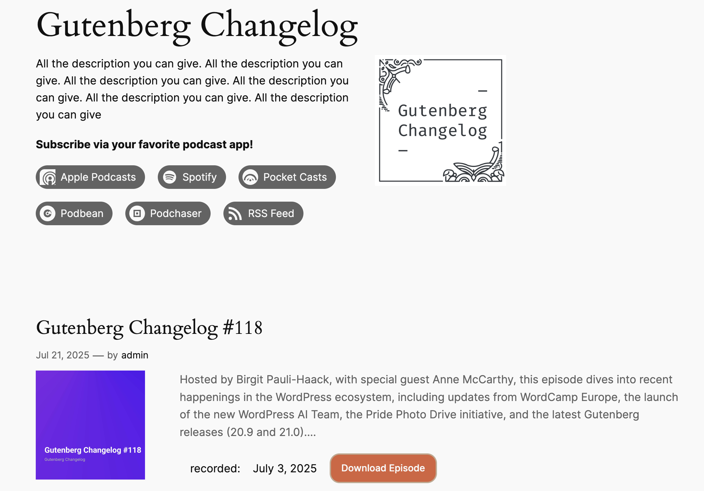

# Podcast data for block themes
Plugin to make podcast data available to the block editor and block themes.

It adds 
- Social Link icons for podcast direcotries 
- BlockBindings for [Seriously Simple podcasting plugin](https://wordpress.org/plugins/seriously-simple-podcasting/) data to to be used in a custom archive template. 

----



Use block markup in the Code Editor: 
### Archive Header

### Podcast description
``` <!-- wp:paragraph {"metadata":{"bindings":{"content":{"source":"gtimes/episode-data","args":{"key":"podcast_description"}}}}} -->
  <p></p>
  <!-- /wp:paragraph -->
```
### Podcast logo
``` 
 <!-- wp:image {"metadata":{"bindings":{"url":{"source":"gtimes/episode-data","args":{"key":"podcast_image"}}}}} -->
  <figure class="wp-block-image"></figure>
  <!-- /wp:image -->
  ```

## Episode Query Loop

### Cover image
```  <!-- wp:image {"align":"left","width":"400px","height":"400px","metadata":{"bindings":{"url":{"source":"gtimes/episode-data","args":
  {"key":"cover_image"}}}}} -->
  <figure class="wp-block-image alignleft" style="width:400px;height:400px"></figure>
  <!-- /wp:image -->
  ```

### Download button
```  <!-- wp:button {"metadata":{"bindings":{"url":{"source":"gtimes/episode-data","args":{"key":"download_link"}}}}} -->
  <div class="wp-block-button"><a class="wp-block-button__link wp-element-button" href="#">Download Episode</a></div>
    <!-- /wp:button -->
  ```
### Recording date
```
  <!-- wp:paragraph {"metadata":{"bindings":{"content":{"source":"gtimes/episode-data","args":{"key":"recording_date"}}}}} -->
  ```

  Next step: 
  Create Block variations for each of the Block Bindings so they can appear in the block inserter for content creators. 
