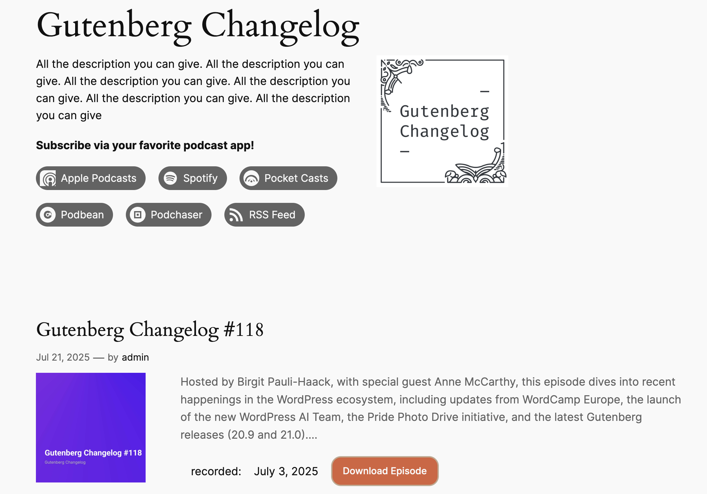
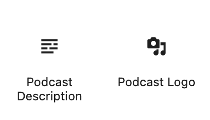
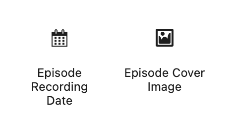
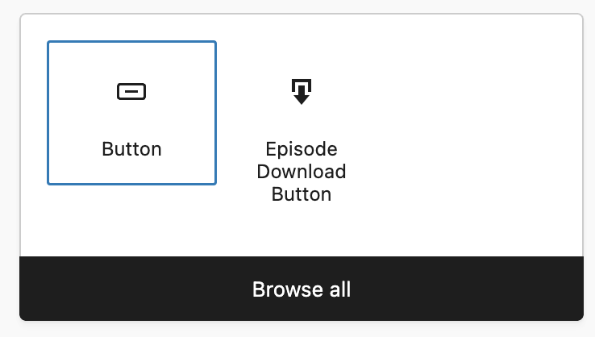

# Podcast data for block themes
Plugin to make podcast data available to the block editor and block themes.

It adds 
- Social Link icons for podcast direcotries 
- BlockBindings for [Seriously Simple podcasting plugin](https://wordpress.org/plugins/seriously-simple-podcasting/) data to to be used in a custom archive template.
- Block Variations for the bound blocks
- An archive template for `taxonomy-series`

Besides the Seriously Simply Podcasting plugins it also need the [Gutenberg plugin v. 21.1](https://wordpress.org/plugins/gutenberg) or WordPress 6.9 after its release to work. 

[](https://playground.wordpress.net?blueprint-url=https://raw.githubusercontent.com/bph/gt-podcast-bb/refs/heads/main/_blueprint/blueprint.json)

----



Use block markup in the Code Editor: 
### Archive Header

### Podcast description
``` 
<!-- wp:paragraph {"metadata":{"bindings":{"content":{"source":"gtimes/episode-data","args":{"key":"podcast_description"}}}}} -->
  <p></p>
  <!-- /wp:paragraph -->
```
### Podcast logo
``` 
 <!-- wp:image {"metadata":{"bindings":{"url":{"source":"gtimes/episode-data","args":{"key":"podcast_image"}}}}} -->
  <figure class="wp-block-image"></figure>
  <!-- /wp:image -->
  ```

## Episode Query Loop

### Cover image
```  
<!-- wp:image {"align":"left","width":"400px","height":"400px","metadata":{"bindings":{"url":{"source":"gtimes/episode-data","args":
  {"key":"cover_image"}}}}} -->
  <figure class="wp-block-image alignleft" style="width:400px;height:400px"></figure>
  <!-- /wp:image -->
 
  ```

### Download button
```  
<!-- wp:button {"metadata":{"bindings":{"url":{"source":"gtimes/episode-data","args":{"key":"download_link"}}}}} -->
  <div class="wp-block-button"><a class="wp-block-button__link wp-element-button" href="#">Download Episode</a></div>
<!-- /wp:button -->
  ```
### Recording date
```
  <!-- wp:paragraph {"metadata":{"bindings":{"content":{"source":"gtimes/episode-data","args":{"key":"recording_date"}}}}} -->
  ```

  ## Block variations
  To make it easier for no-code content creator to use those block bindinds, I added Block variations to the plugin. 
  - Episode Recording Date 
  - Podcast Description
  - Episode Cover Image
  - Podcast Logo 
  - Episode Download Button 

  
  


  > [!TIP]
  > They all appear with their names in the Block editor inserter, except for the Download button, it only appears once there is a "Buttons" block on canvas and it is added to the parent block. 



