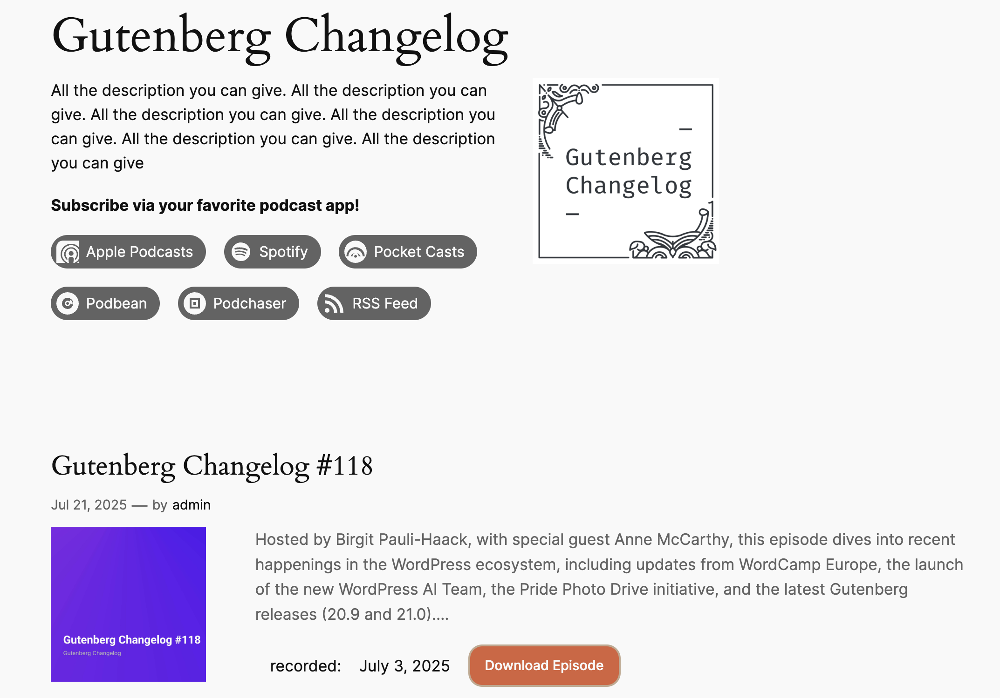
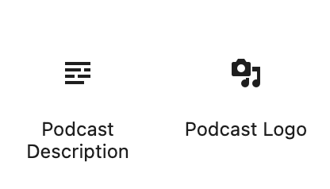
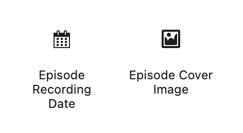
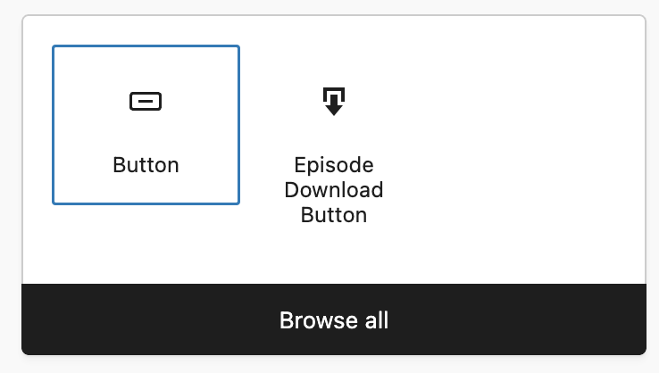

# GT Podcast Block Bindings

**Make podcast data available in WordPress block themes**

[](https://github.com/bph/gt-podcast-bb)
[](https://wordpress.org/)
[](https://www.gnu.org/licenses/gpl-2.0.html)
[](https://playground.wordpress.net?blueprint-url=https://raw.githubusercontent.com/bph/gt-podcast-bb/refs/heads/main/_blueprint/blueprint.json)

GT Podcast Block Bindings seamlessly integrates podcast metadata with the WordPress block editor. Display podcast episode and series information in block-based themes without writing code.

## 📚 Documentation

**[View Full Documentation →](https://bph.github.io/gt-podcast-bb/)**

- **[Getting Started](https://bph.github.io/gt-podcast-bb/getting-started)** - Installation and setup
- **[Usage Guide](https://bph.github.io/gt-podcast-bb/usage)** - Examples and patterns
- **[API Reference](https://bph.github.io/gt-podcast-bb/api-reference)** - Technical documentation
- **[Development](https://bph.github.io/gt-podcast-bb/development)** - Contributing guide
- **[FAQ](https://bph.github.io/gt-podcast-bb/faq)** - Common questions

## ✨ Features

### Block Bindings for Podcast Data
Connect WordPress blocks to podcast metadata from the [Seriously Simple Podcasting](https://wordpress.org/plugins/seriously-simple-podcasting/) plugin:
- Episode recording dates
- Download links
- Podcast descriptions
- Cover images and logos

### Block Variations
Pre-configured blocks for podcast data:
- Episode Recording Date
- Podcast Description
- Episode Cover Image
- Podcast Logo
- Episode Download Button
- Episode Audio Player

### Social Media Icons
Custom social link variations for podcast platforms:
- Apple Podcasts
- Pocket Casts
- CastBox
- Podbean
- Podchaser

### Archive Template
Ready-made `taxonomy-series` template for displaying podcast episodes with metadata.

## 🚀 Quick Start

1. Install and activate the plugin
2. Install [Seriously Simple Podcasting](https://wordpress.org/plugins/seriously-simple-podcasting/)
3. Configure your podcast in Podcasts → Settings
4. Use block variations in the editor or bind blocks manually

## 📋 Requirements

- **WordPress:** 6.8 or higher
- **PHP:** 7.4 or higher
- **Gutenberg Plugin:** v21.1+ (or WordPress 6.9+)
- **Required Plugin:** [Seriously Simple Podcasting](https://wordpress.org/plugins/seriously-simple-podcasting/)

## 📸 Screenshots


*Podcast archive page showing episodes with metadata*

Use block markup in the Code Editor: 
### Archive Header

### Podcast description
``` 
<!-- wp:paragraph {"metadata":{"bindings":{"content":{"source":"gtimes/episode-data","args":{"key":"podcast_description"}}}}} -->
  <p></p>
  <!-- /wp:paragraph -->
```
### Podcast logo
``` 
 <!-- wp:image {"metadata":{"bindings":{"url":{"source":"gtimes/episode-data","args":{"key":"podcast_image"}}}}} -->
  <figure class="wp-block-image"></figure>
  <!-- /wp:image -->
  ```

## Episode Query Loop

### Cover image
```  
<!-- wp:image {"align":"left","width":"400px","height":"400px","metadata":{"bindings":{"url":{"source":"gtimes/episode-data","args":
  {"key":"cover_image"}}}}} -->
  <figure class="wp-block-image alignleft" style="width:400px;height:400px"></figure>
  <!-- /wp:image -->
 
  ```

### Download button
```  
<!-- wp:button {"metadata":{"bindings":{"url":{"source":"gtimes/episode-data","args":{"key":"download_link"}}}}} -->
  <div class="wp-block-button"><a class="wp-block-button__link wp-element-button" href="#">Download Episode</a></div>
<!-- /wp:button -->
  ```
### Recording date
```
  <!-- wp:paragraph {"metadata":{"bindings":{"content":{"source":"gtimes/episode-data","args":{"key":"recording_date"}}}}} -->
  ```


*Podcast block variations in the inserter*


*Episode block variations*


*Episode download button variation*

## 🔧 Development

### Build from Source

```bash
git clone https://github.com/bph/gt-podcast-bb.git
cd gt-podcast-bb
npm install
npm run build
```

### Contributing

Contributions are welcome! Please see the [Development Guide](https://bph.github.io/gt-podcast-bb/development) for details.

## 📖 Usage Examples

### Manual Block Binding

```html
<!-- Bind paragraph to recording date -->
<!-- wp:paragraph {"metadata":{"bindings":{"content":{"source":"gt-podcast-bb/episode-data","args":{"key":"recording_date"}}}}} -->
<p></p>
<!-- /wp:paragraph -->

<!-- Bind button to download link -->
<!-- wp:button {"metadata":{"bindings":{"url":{"source":"gt-podcast-bb/episode-data","args":{"key":"download_link"}}}}} -->
<div class="wp-block-button">
  <a class="wp-block-button__link" href="#">Download Episode</a>
</div>
<!-- /wp:button -->
```

For more examples, see the [Usage Guide](https://bph.github.io/gt-podcast-bb/usage).

## 📝 License

This plugin is licensed under the [GPL v2 or later](https://www.gnu.org/licenses/gpl-2.0.html).

## 👤 Author

**Birgit Pauli-Haack**
- Website: [icodeforapurpose.com](https://icodeforapurpose.com/about)
- GitHub: [@bph](https://github.com/bph)

## 🤝 Support

- **Documentation:** [bph.github.io/gt-podcast-bb](https://bph.github.io/gt-podcast-bb/)
- **Issues:** [GitHub Issues](https://github.com/bph/gt-podcast-bb/issues)
- **WordPress.org:** [Support Forum](https://wordpress.org/support/plugin/gt-podcast-bb/)

